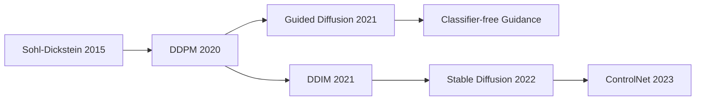

# 1.1 扩散模型基础概念

## 目录
- [什么是扩散模型](#什么是扩散模型)
- [核心思想](#核心思想)
- [历史发展](#历史发展)
- [优势与特点](#优势与特点)
- [应用领域](#应用领域)
- [与其他生成模型的对比](#与其他生成模型的对比)

## 什么是扩散模型

扩散模型（Diffusion Models）是一类基于**逐步去噪**思想的深度生成模型。其核心理念是模拟物理世界中的**扩散过程**：

- **前向过程（加噪）**：将真实数据逐步添加高斯噪声，直到完全变成随机噪声
- **反向过程（去噪）**：学习从噪声中逐步恢复原始数据的过程

### 直观理解

想象一滴墨水滴在水中的扩散过程：
1. **前向**：清晰的墨水团 → 逐渐扩散 → 完全混合的浑浊水
2. **反向**：浑浊水 → 逐步清晰 → 恢复原始墨水团

扩散模型就是要学会这个"时光倒流"的反向过程！

## 核心思想

### 1. 马尔可夫链过程

扩散模型基于马尔可夫链，具有以下特性：
- **无记忆性**：当前状态只依赖于前一个状态
- **渐进性**：变化是逐步、缓慢的
- **可逆性**：理论上每一步都可以被逆转

### 2. 概率建模

```
真实数据分布 p(x₀)
    ↓ 前向扩散
噪声分布 p(x_T) ≈ N(0,I)
    ↓ 反向去噪  
生成数据分布 p_θ(x₀)
```

### 3. 变分下界

扩散模型通过最大化数据的对数似然来训练：
```
log p_θ(x₀) ≥ ELBO = E_q[log p_θ(x₀|x₁)] - D_KL(q(x_T|x₀)||p(x_T)) - ...
```

## 历史发展

### 关键里程碑

| 年份 | 论文 | 贡献 |
|------|------|------|
| 2015 | Deep Unsupervised Learning using Nonequilibrium Thermodynamics | 首次提出扩散模型概念 |
| 2020 | DDPM | 简化训练目标，奠定现代扩散模型基础 |
| 2021 | DDIM | 加速采样，实现确定性生成 |
| 2021 | Guided Diffusion | 引入分类器引导 |
| 2022 | Stable Diffusion | 潜在空间扩散，大幅降低计算成本 |
| 2023 | ControlNet | 精确控制生成内容 |

### 技术演进



## 优势与特点

### ✅ 主要优势

1. **生成质量高**
   - 能产生高分辨率、高质量的图像
   - 细节丰富，视觉效果优秀

2. **训练稳定**
   - 不存在模式崩塌问题（相比GAN）
   - 训练过程稳定，收敛可靠

3. **理论基础扎实**
   - 基于严格的概率理论
   - 有完善的数学推导

4. **可控性强**
   - 支持条件生成
   - 可以精确控制生成过程

5. **多样性好**
   - 能生成多样化的样本
   - 覆盖数据分布的各个区域

### ⚠️ 主要限制

1. **推理速度慢**
   - 需要多步迭代去噪
   - 计算成本较高

2. **内存需求大**
   - 需要存储多个时间步的状态
   - 对硬件要求较高

## 应用领域

### 🎨 图像生成
- **文本到图像**：根据文字描述生成图像
- **图像编辑**：修复、风格转换、超分辨率
- **艺术创作**：数字艺术、插画生成

### 🎵 音频生成
- **音乐合成**：旋律、和声生成
- **语音合成**：文本到语音转换
- **音效制作**：环境音、特效音

### 📝 其他模态
- **视频生成**：动画、特效制作
- **3D模型**：三维形状生成
- **分子设计**：药物分子发现

## 与其他生成模型的对比

### 详细对比表

| 特性 | 扩散模型 | GAN | VAE | 流模型 |
|------|----------|-----|-----|--------|
| **生成质量** | ⭐⭐⭐⭐⭐ | ⭐⭐⭐⭐ | ⭐⭐⭐ | ⭐⭐⭐⭐ |
| **训练稳定性** | ⭐⭐⭐⭐⭐ | ⭐⭐ | ⭐⭐⭐⭐ | ⭐⭐⭐⭐ |
| **推理速度** | ⭐⭐ | ⭐⭐⭐⭐⭐ | ⭐⭐⭐⭐ | ⭐⭐⭐ |
| **多样性** | ⭐⭐⭐⭐⭐ | ⭐⭐⭐ | ⭐⭐⭐ | ⭐⭐⭐⭐ |
| **可控性** | ⭐⭐⭐⭐⭐ | ⭐⭐⭐ | ⭐⭐⭐ | ⭐⭐⭐ |

### 核心差异

#### 🔄 扩散模型 vs GAN
```python
# 扩散模型：渐进式生成
x_T ~ N(0,I)  # 从噪声开始
x_{T-1} = denoise(x_T)  # 逐步去噪
x_{T-2} = denoise(x_{T-1})
...
x_0 = denoise(x_1)  # 最终结果

# GAN：一步生成
z ~ N(0,I)  # 从噪声开始
x = Generator(z)  # 一步生成结果
```

#### 📊 扩散模型 vs VAE
```python
# 扩散模型：固定编码器
q(x_t|x_{t-1}) = N(√α_t x_{t-1}, β_t I)  # 固定前向过程

# VAE：学习编码器
z = Encoder(x)  # 学习的编码器
x = Decoder(z)  # 学习的解码器
```

## 数学符号说明

| 符号 | 含义 |
|------|------|
| `x₀` | 原始真实数据 |
| `x_t` | 第t步的数据状态 |
| `T` | 总扩散步数 |
| `β_t` | 第t步的噪声比例 |
| `α_t` | 第t步的信号保留比例 |
| `ε` | 高斯噪声 |
| `θ` | 模型参数 |

## 实践要点

### 🎯 学习建议

1. **从概念开始**
   - 理解扩散的物理直觉
   - 掌握前向和反向过程

2. **数学基础**
   - 概率论基础
   - 变分推断理论

3. **动手实践**
   - 从简单的1D例子开始
   - 逐步扩展到图像生成

### 🔧 实现要点

1. **噪声调度**
   - 选择合适的β序列
   - 平衡训练效率和质量

2. **网络架构**
   - UNet是主流选择
   - 注意力机制很重要

3. **训练技巧**
   - 合适的学习率
   - 正确的数据预处理

## 下一步学习

在理解了基础概念后，我们将深入学习：

1. **[前向扩散过程](./02_forward_process.md)** - 如何逐步添加噪声
2. **[反向去噪过程](./03_reverse_process.md)** - 如何从噪声中恢复数据
3. **[训练目标与损失函数](./04_training_objectives.md)** - 如何训练扩散模型

---

**💡 关键要点总结**

扩散模型通过模拟**渐进的噪声扩散过程**，学会了从纯噪声中**逐步生成高质量数据**的能力。其核心优势在于：
- 🎯 **生成质量高且稳定**
- 🔧 **训练过程可靠**  
- 🎨 **可控性强**

虽然推理速度较慢，但随着加速技术的发展，扩散模型已成为当前最先进的生成模型之一！